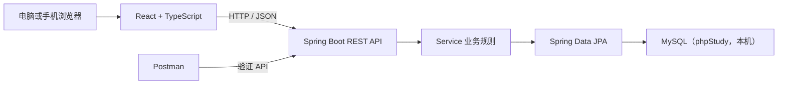
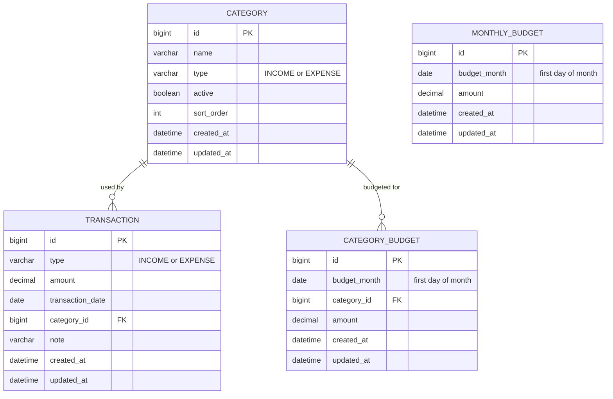
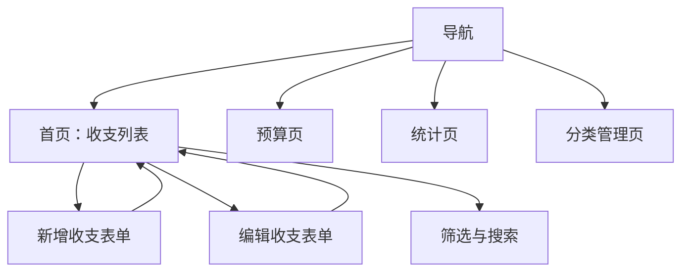

# 个人记账应用设计文档

## 1. 设计目标

本设计对应第一版需求：单用户、单账本，在电脑运行服务并通过同一 Wi-Fi 向电脑和手机浏览器提供服务。项目用于学习 React、Spring Boot、MySQL 与前后端分离开发；因此优先选择边界清晰、便于逐层验证的方案，而不是过早引入复杂框架或基础设施。

## 2. 技术选型

| 范围 | 选择 | 说明 |
|---|---|---|
| 前端 | React + TypeScript + Vite | 响应式 Web 界面；用 VS Code 开发。 |
| 后端 | Java 21 + Spring Boot + Maven | REST API、校验、业务规则；用 IntelliJ IDEA 开发。 |
| 数据库 | MySQL（phpStudy 管理） | 仅允许本机 Spring Boot 连接。 |
| 数据访问 | Spring Data JPA | 映射实体与数据访问层。 |
| 数据库迁移 | Flyway | 用版本化 SQL 创建并演进表结构。 |
| 图表 | Recharts | 用于月度统计和预算对比。 |
| 后端测试 | JUnit 5、Mockito、MockMvc | 分别验证业务、HTTP 接口与参数校验。 |
| 手工接口验收 | Postman | 在 React 接入前验证 API 和真实 MySQL。 |

第一版前端使用 `fetch`、`useState` 和 `useEffect`，暂不使用 Redux、React Query、Axios 或微服务。

## 3. 总体架构



开发时，React 的 Vite 开发服务器与 Spring Boot 分别启动。发布时，React 构建结果可由 Spring Boot 托管；手机与电脑只访问 Spring Boot，不直接访问 MySQL。

## 4. 数据模型

### 4.1 表与职责

| 表 | 职责 | 关键字段与约束 |
|---|---|---|
| `categories` | 管理收入、支出分类 | `id`、`name`、`type`、`active`、`sort_order`、时间戳；同一类型内名称唯一。 |
| `transactions` | 保存每笔收支记录 | `id`、`type`、`amount DECIMAL(12,2)`、`transaction_date`、`category_id`、`note`、时间戳。 |
| `monthly_budgets` | 保存每月总支出预算 | `id`、`budget_month`、`amount DECIMAL(12,2)`；每月最多一条。 |
| `category_budgets` | 保存每月分类支出预算 | `id`、`budget_month`、`category_id`、`amount DECIMAL(12,2)`；每月每分类最多一条。 |

金额在 Java 中使用 `BigDecimal`，在 MySQL 中使用 `DECIMAL(12,2)`。统计与预算已用金额均由收支记录实时计算，不保存冗余汇总表。



### 4.2 业务约束

- 分类创建后类型不可改；收入和支出分类各自管理。
- 新增或修改交易时，交易类型必须与分类类型一致，且分类必须启用。
- 分类预算只能关联支出分类。
- 有历史交易的分类只能停用，不能物理删除。
- 交易可永久删除，但前端必须先二次确认。
- `budget_month` 使用每月第一天保存，例如 `2026-09-01` 代表 2026 年 9 月。

## 5. 后端设计

### 5.1 分层与目录

后端采用按业务功能分包、包内分层的结构：

```text
backend/src/main/java/<base-package>/
├─ common/          # 统一异常、错误响应、配置
├─ category/        # controller、service、repository、entity、dto
├─ transaction/     # controller、service、repository、entity、dto
├─ budget/          # controller、service、repository、entity、dto
└─ statistics/      # controller、service、dto
```

- Controller：接收 HTTP 请求、调用 Service、返回 DTO。
- Service：校验跨字段业务规则、编排查询和写入。
- Repository：只负责数据库访问。
- Entity：JPA 数据库映射，不直接作为 API 返回对象。
- DTO：隔离 API 输入输出与数据库表。

### 5.2 API 清单

| 模块 | 方法与路径 | 用途 |
|---|---|---|
| 分类 | `GET /api/categories` | 按类型、启用状态查询分类。 |
| 分类 | `POST /api/categories` | 创建分类。 |
| 分类 | `PUT /api/categories/{id}` | 修改分类名称、排序。 |
| 分类 | `PATCH /api/categories/{id}/status` | 启用或停用分类。 |
| 交易 | `GET /api/transactions` | 分页查询；支持日期、类型、分类、关键字筛选。 |
| 交易 | `POST /api/transactions` | 新增交易。 |
| 交易 | `PUT /api/transactions/{id}` | 修改交易。 |
| 交易 | `DELETE /api/transactions/{id}` | 永久删除交易。 |
| 预算 | `GET /api/budgets?month=YYYY-MM` | 查询该月总预算与分类预算。 |
| 预算 | `PUT /api/budgets/monthly` | 以请求体中的月份和金额新增或更新月总预算。 |
| 预算 | `PUT /api/budgets/categories/{categoryId}` | 以请求体中的月份和金额新增或更新分类预算。 |
| 预算 | `DELETE /api/budgets/monthly?month=YYYY-MM` | 清除该月月总预算。 |
| 预算 | `DELETE /api/budgets/categories/{categoryId}?month=YYYY-MM` | 清除该月该分类预算。 |
| 统计 | `GET /api/statistics/monthly?month=YYYY-MM` | 返回月度汇总、分类占比和预算使用情况。 |

### 5.3 校验与错误处理

请求 DTO 使用 Jakarta Validation 校验金额、日期、分类等字段。Service 负责分类状态、类型匹配、预算唯一性等业务校验。全局异常处理器统一返回错误结构：

```json
{
  "status": 400,
  "code": "VALIDATION_ERROR",
  "message": "请求参数不合法",
  "fieldErrors": {
    "amount": "金额必须大于 0"
  }
}
```

- `400`：字段或业务规则不合法。
- `404`：记录、分类或预算不存在。
- `409`：分类名或预算出现唯一性冲突。
- `500`：未知服务端错误；不得向客户端暴露敏感配置或堆栈。

## 6. 前端设计

### 6.1 目录与数据流

```text
frontend/src/
├─ api/          # fetch 封装及各模块请求
├─ pages/        # 路由页面
├─ components/   # 可复用的表单、列表、筛选、弹窗组件
├─ types/        # API 与页面数据类型
└─ styles/       # 全局与页面样式
```

每个页面使用 `useEffect` 加载数据，并以 `useState` 保存页面局部状态。新增、编辑、删除成功后重新加载当前页面数据。筛选条件同步到 URL 查询参数，便于刷新后保留当前筛选。

所有页面必须包含：加载中、成功、无数据、请求失败（含重试）四种状态。

### 6.2 页面与路由

| 路由 | 页面 | 数据与交互 |
|---|---|---|
| `/` | 收支记录首页 | 按日期倒序、按日期分组显示交易；支持筛选、搜索、新增、编辑、删除。 |
| `/budgets` | 预算页 | 查看和设置月总预算、分类预算、已用/剩余/超支状态。 |
| `/statistics` | 统计页 | 月份切换、收支汇总、分类占比及预算对比图表。 |
| `/categories` | 分类管理页 | 在收入与支出分类之间切换，创建、修改、启用、停用分类。 |

桌面端使用左侧导航；手机端使用底部导航。“新增收支”应在首页醒目呈现。首页不显示仪表盘，打开后直接展示按日期排列的收入与支出列表。



## 7. 配置与安全

- phpStudy 负责启动本机 MySQL；手机不连接数据库。
- 为项目单独创建 MySQL 数据库和普通账户，不使用 `root`。
- 提交 `application-example.yml`，不含密码；本机使用 `application-local.yml` 保存真实连接信息。
- `application-local.yml`、前端本地环境文件和真实账本数据不得提交到 Git。
- 生产或局域网启动时，Spring Boot 对外提供 HTTP 服务；数据库仍仅绑定本机。

## 8. 验证策略

每个功能按以下顺序验证：

1. Service：使用 JUnit 5 和 Mockito 测试业务规则与异常分支。
2. Controller：使用 MockMvc 测试状态码、JSON 格式和参数校验。
3. API：使用 Postman 和真实 MySQL 完整验证增删改查。
4. 页面：在浏览器中验证表单、筛选、错误提示和响应式布局。

Postman Collection 置于仓库 `postman/`，作为 API 使用示例和手工验收资料。

## 9. 实施学习阶段

| 阶段 | 你将完成的内容 | 验证方式 |
|---|---|---|
| 1 | 创建 MySQL 数据库与 Spring Boot 空项目，完成连接测试 | 启动日志和简单健康检查。 |
| 2 | 分类管理 API | JUnit、Postman。 |
| 3 | 收支记录 API 与首页列表 | Postman 后接入 React。 |
| 4 | 月总预算与分类预算 | 业务规则测试、Postman、预算页。 |
| 5 | 月度统计 API 与图表页 | 固定测试数据与浏览器图表检查。 |
| 6 | 补齐测试、README、Postman Collection、局域网运行说明 | 按 README 在新环境复现运行。 |

实施时由你编写代码；我按阶段解释概念、拆解小任务、审阅代码与协助排查问题。

## 10. 设计范围外

第一版不包含登录、多用户、多账户、云端同步、导入导出、自动备份、多币种、周期交易和附件。新增这些能力时，需要先重新评估数据模型与安全边界。
