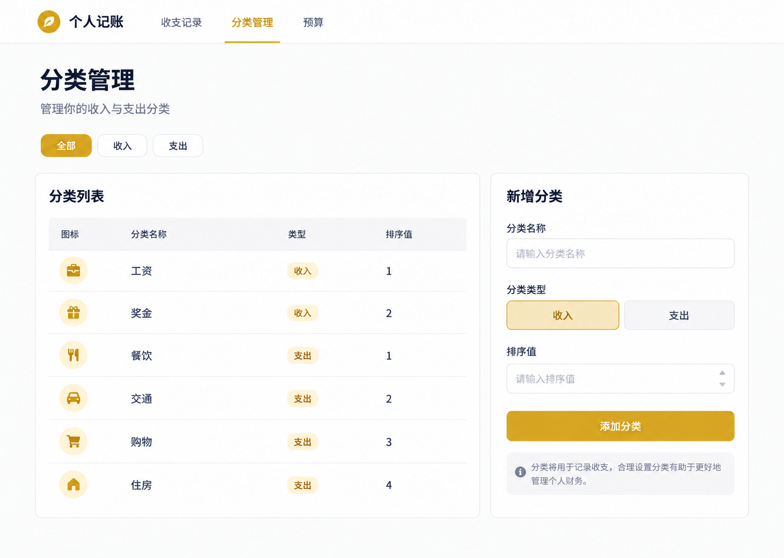
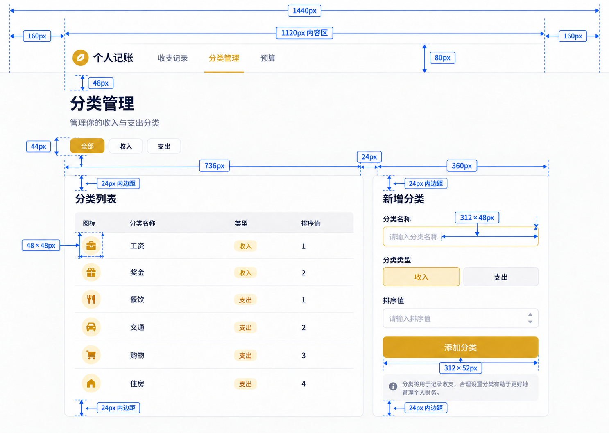
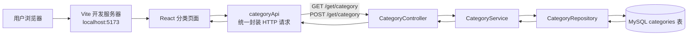
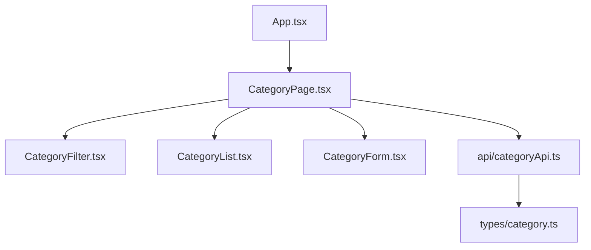
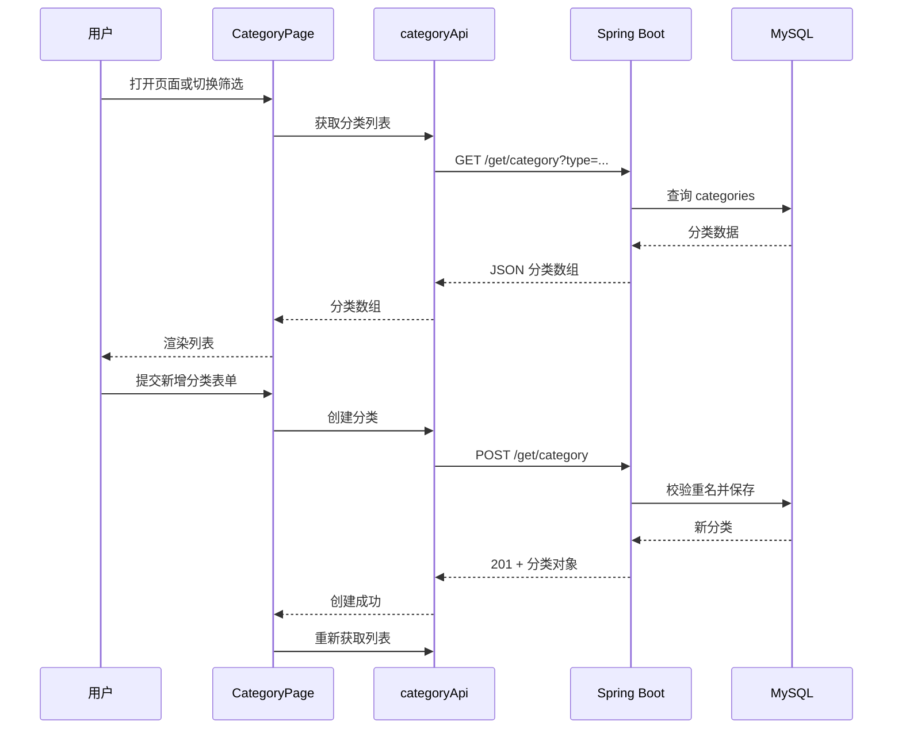

# 分类页面第一版设计

**日期：** 2026-09-30  
**状态：** 已确认设计，待开始开发

## 0. 页面视觉稿

这是一张用于实现参考的桌面端高保真视觉稿。它对应本次范围：分类列表、收入/支出筛选和新增分类；不包含编辑、删除或启用/停用操作。



### 带标注的交付图

下图是实现时优先参考的标注版。蓝色箭头表示宽度、高度或间距；所有数值以 `px` 为单位。



## 0.1 桌面端尺寸与间距标注

以下尺寸以 **1440px 宽度的浏览器窗口** 为基准，单位均为 CSS `px`。实现时优先保持这些比例；宽度缩小时再通过响应式布局调整。

```text
浏览器宽度：1440
├─ 左侧留白：160
├─ 主内容区域：1120
│  ├─ 分类列表卡片：736
│  ├─ 卡片间距：24
│  └─ 新增分类卡片：360
└─ 右侧留白：160
```

| 区域或组件 | 宽度 / 高度 | 与相邻组件的间距 | 说明 |
|---|---:|---:|---|
| 顶部导航栏 | 高 80 | 下方 48 | 全宽，内容与主区域左边缘对齐 |
| 主内容最大宽度 | 1120 | 自动左右居中 | 屏幕大于 1120 时保留两侧留白 |
| 页面标题 | 字号 36，行高 44 | 标题与说明 8 | “分类管理” |
| 标题说明文字 | 字号 16，行高 24 | 与筛选栏 24 | “管理你的收入与支出分类” |
| 筛选按钮组 | 高 44 | 按钮之间 8；与卡片区 24 | 每个按钮宽 96，圆角 10 |
| 卡片区 | 宽 1120 | 两列之间 24 | 左 736 + 间距 24 + 右 360 |
| 分类列表卡片 | 宽 736，最小高 560 | 内边距 24 | 分类表格随数据行数增高 |
| 新增分类卡片 | 宽 360，建议高 560 | 内边距 24 | 在桌面端与左侧卡片顶部对齐 |
| 卡片圆角 | 12 | — | 边框使用浅灰色 1px |
| 卡片标题 | 字号 24，行高 32 | 与内容 24 | “分类列表”“新增分类” |
| 表格表头 | 高 60 | 表头到第一行 0 | 背景使用很浅的灰色 |
| 分类数据行 | 高 82 | 行与行之间无额外间距 | 使用下边框分隔 |
| 圆形图标 | 48 × 48 | 图标到名称 16 | 只作视觉提示，第一版可先不用真实图标 |
| 类型标签 | 高 28 | — | 横向内边距 10，圆角 14 |
| 表单标签 | 字号 14，行高 20 | 标签到输入框 8 | 每个字段组之间 20 |
| 文本 / 数字输入框 | 宽 312，高 48 | — | 宽度 = 卡片 360 - 左右内边距 48 |
| 收入 / 支出选择器 | 宽 312，高 48 | 两个选项之间 0 | 每个选项宽 156 |
| 添加分类按钮 | 宽 312，高 52 | 与上一字段 24 | 主要操作按钮 |
| 表单提示区域 | 宽 312，最小高 52 | 与按钮 16 | 用于加载、成功或错误提示 |

### 垂直节奏

```text
导航栏底部
  ↓ 48
页面标题（44 高）
  ↓ 8
说明文字（24 高）
  ↓ 24
筛选按钮（44 高）
  ↓ 24
列表卡片 + 新增分类卡片
```

### 小屏幕规则

当窗口宽度低于 `900px` 时，卡片区改为单列：分类列表占满可用宽度，新增分类卡片放到列表下方，二者垂直间距保持 `24px`。这让同一套页面在手机或窄屏电脑上仍可使用。

## 1. 目标与范围

分类页面是个人记账应用的第一个前端页面。用户可以在网页中查看已有分类、按收入或支出筛选，并新增一个分类；所有数据都通过后端接口读写 MySQL。

本次范围包括：

- 展示所有启用的收入、支出分类；
- 按“全部 / 收入 / 支出”筛选；
- 新增分类：名称、类型、排序值；
- 重名、网络异常等错误提示；
- 新增成功后自动刷新分类列表。

本次不包括编辑名称、启用/停用、删除分类、登录和预算功能。这些将作为后续小阶段继续完成。

## 2. 技术结构

- 前端：React + TypeScript + Vite，使用 VS Code 开发；
- 后端：已有 Spring Boot 服务，运行于 `http://localhost:8080`；
- 数据库：phpStudy MySQL 的 `personal_finance` 数据库；
- 前端开发服务器：Vite 默认运行于 `http://localhost:5173`；
- 跨域：后端仅允许本地开发地址 `http://localhost:5173` 访问分类接口。



## 3. 前端目录与职责

前端工程位于项目根目录的 `frontend/`，与 `backend/` 并列。

```text
frontend/
├─ src/
│  ├─ api/
│  │  └─ categoryApi.ts       # 调用后端分类接口
│  ├─ components/
│  │  ├─ CategoryFilter.tsx   # “全部/收入/支出”筛选按钮
│  │  ├─ CategoryForm.tsx     # 新增分类表单
│  │  └─ CategoryList.tsx     # 分类列表及空状态展示
│  ├─ pages/
│  │  └─ CategoryPage.tsx     # 组合页面、管理请求和状态
│  ├─ types/
│  │  └─ category.ts          # Category、CategoryType 等 TypeScript 类型
│  ├─ App.tsx                 # 当前应用入口，先显示 CategoryPage
│  └─ main.tsx                # React 挂载入口
└─ package.json               # 前端依赖和运行命令
```



`CategoryPage` 是页面的协调者：保存当前筛选条件、分类列表、加载状态和错误消息；其余组件只接收数据与回调，不直接访问后端。

## 4. 页面布局

```mermaid
flowchart TB
    PAGE[分类管理页面]
    PAGE --> TITLE[标题：分类管理]
    PAGE --> FILTER[筛选栏：全部 | 收入 | 支出]
    PAGE --> LIST[分类列表\n名称 / 类型 / 排序]
    PAGE --> FORM[新增分类卡片\n名称输入框 / 类型选择 / 排序输入框 / 新增按钮]
    PAGE --> MESSAGE[加载提示、空状态、错误或成功提示]
```

页面先以桌面浏览器为主，使用单列布局：上方筛选和列表，下方新增表单。后续接入手机端时，表单和列表仍可自然纵向排列。

## 5. 数据与接口设计

### 5.1 前端分类数据

```ts
type CategoryType = 'INCOME' | 'EXPENSE';

interface Category {
  id: number;
  name: string;
  type: CategoryType;
  sortOrder: number;
  active: boolean;
}
```

前端将 `INCOME` 显示为“收入”，`EXPENSE` 显示为“支出”；数据传给后端时仍使用英文枚举值。

### 5.2 后端接口

| 用途 | 方法与地址 | 请求 | 成功响应 |
|---|---|---|---|
| 查询分类 | `GET /get/category` | 可选：`type=INCOME` 或 `type=EXPENSE` | 分类数组，按排序值和 id 排列 |
| 新增分类 | `POST /get/category` | `{ "name", "type", "sortOrder" }` | HTTP 201 和新建分类对象 |

新增时，后端负责校验：名称不能为空、长度不超过 50、类型不能为空、排序值不能为负数、同一类型下名称不能重复。

## 6. 页面数据流



## 7. 错误处理与检查

- 页面加载期间显示“正在加载分类”；
- 无分类时显示“暂时没有分类”；
- 新增成功显示简短成功提示，并清空表单；
- 后端返回重名错误时，展示后端返回的中文错误消息；
- 后端不可访问时，提示用户确认后端是否在 8080 端口运行；
- 开发完成后，启动 MySQL、后端和前端，手动验证查询、筛选、新增和重复新增四种情况。

## 8. 本次完成标准

满足以下条件即认为分类页面第一版完成：

1. 浏览器能打开 React 页面，并加载数据库中的分类；
2. 切换“收入 / 支出”时，列表内容正确变化；
3. 新增一个合法分类后，数据库和列表均出现该分类；
4. 重复新增同类型同名称分类时，页面显示清晰错误；
5. 前端、后端均能正常启动，后端测试在 MySQL 已启动时通过。
